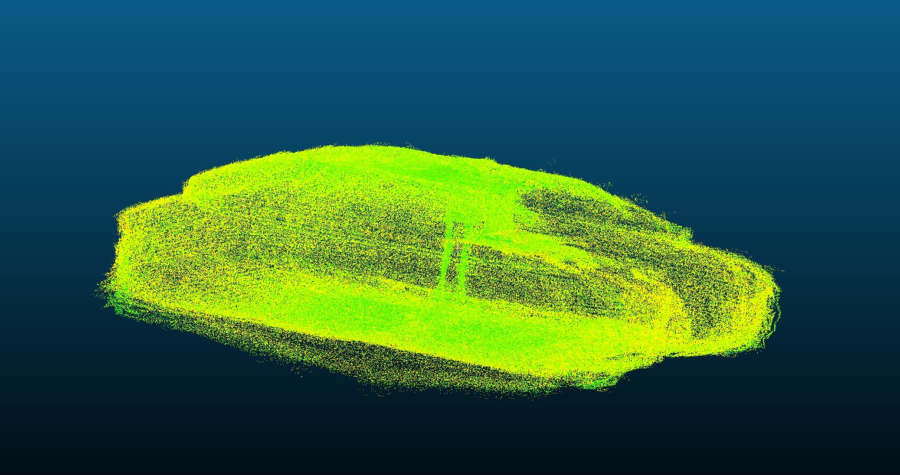
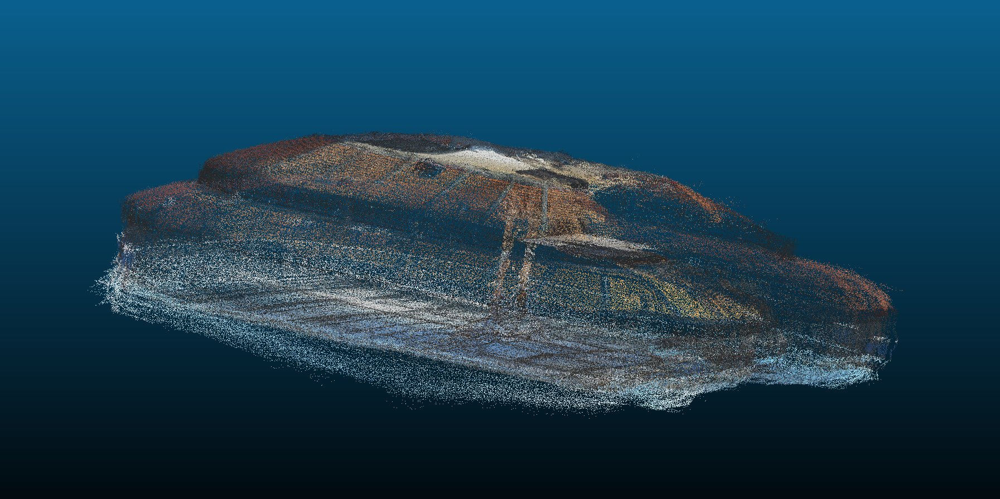

# GS PLY → RGB PLY Converter

A browser-based tool to convert Gaussian Splatting `.ply` files into standard RGB point clouds, no installation required.

I created this tool after running into a problem while exporting .ply files from Marble World Labs(https://marble.worldlabs.ai/).

---

## Before & after

| Before | After |
|--------|-------|
|  |  |

---

## Live demo

👉 [**Open the converter**](https://gabriverga.github.io/gs-ply-converter)

---

## How to use

**1. Open the page**
Go to the link above. No installation, no account needed.

**2. Drop your file**
Drag and drop your Gaussian Splatting `.ply` file into the drop zone, or click to browse.

**3. Convert**
Click **Convert to RGB PLY**. A progress bar will show the conversion status. Depending on the file size this may take a few seconds.

**4. Download**
Once done, click **Download converted .ply** to save the file.

---

**Compatible with:** Unity, CloudCompare, Blender, Houdini...

---

## Credits

Created by [@gabriverga](https://www.instagram.com/gabriverga/) with Claude Code
